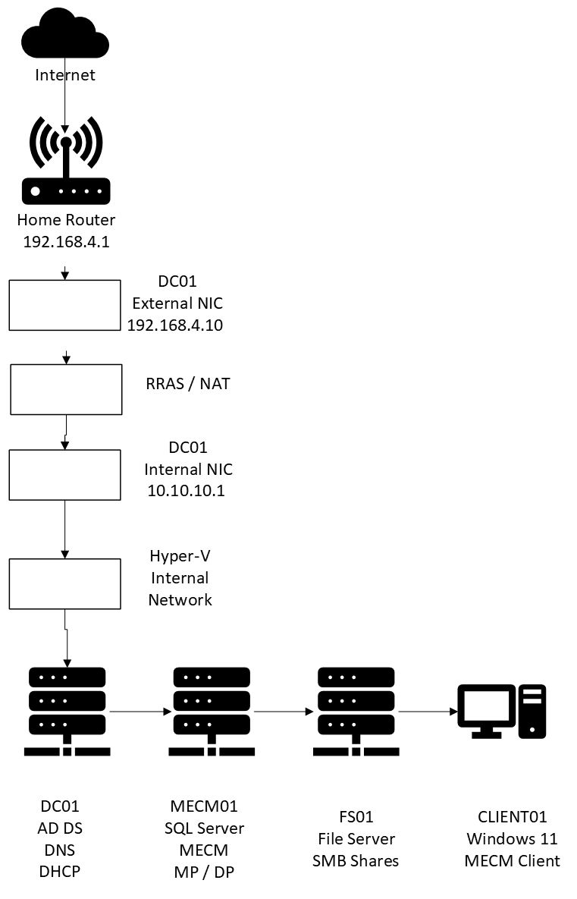

# Enterprise MECM Homelab

An enterprise Windows infrastructure built entirely in a home lab.

This project demonstrates the deployment and administration of Microsoft enterprise technologies including:

* Active Directory Domain Services
* DNS
* DHCP
* Group Policy
* Hyper V
* RRAS NAT
* SQL Server
* Microsoft Configuration Manager (MECM/SCCM)
* Windows 11 Client Management
* PowerShell Automation

---

## Architecture

---

## Current Environment

| Server | Operating System | Purpose |
|---------|-----------------|----------|
| DC01 | Windows Server 2025 | AD DS, DNS, DHCP, RRAS |
| MECM01 | Windows Server 2025 | SQL Server + MECM |
| FS01 | Windows Server 2022 | File Server |
| CLIENT01 | Windows 11 | Managed Client |

---

## Technologies

* Active Directory
* Group Policy
* DNS
* DHCP
* Hyper V
* SQL Server
* MECM
* Windows Server
* Windows 11
* PowerShell
* Git
* GitHub

---

## Project Status

✅ Active Directory

✅ DNS

✅ DHCP

✅ RRAS

✅ SQL Server

✅ MECM

✅ Client Deployment

⬜ WSUS

⬜ PKI

⬜ Infrastructure as Code

⬜ Intune

⬜ Monitoring