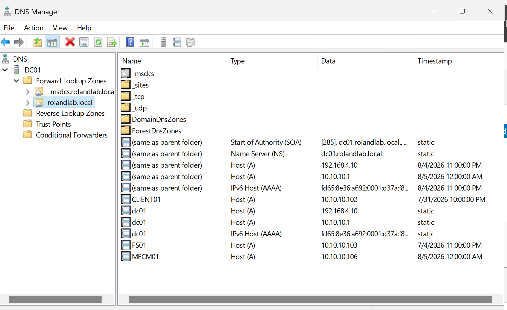
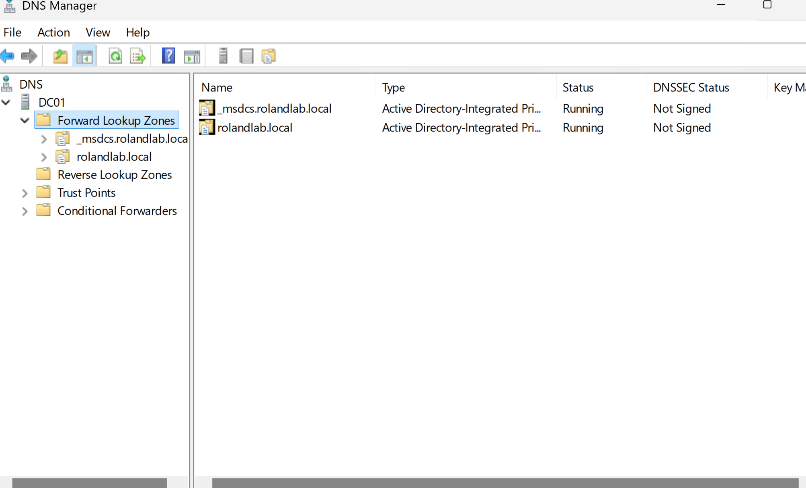
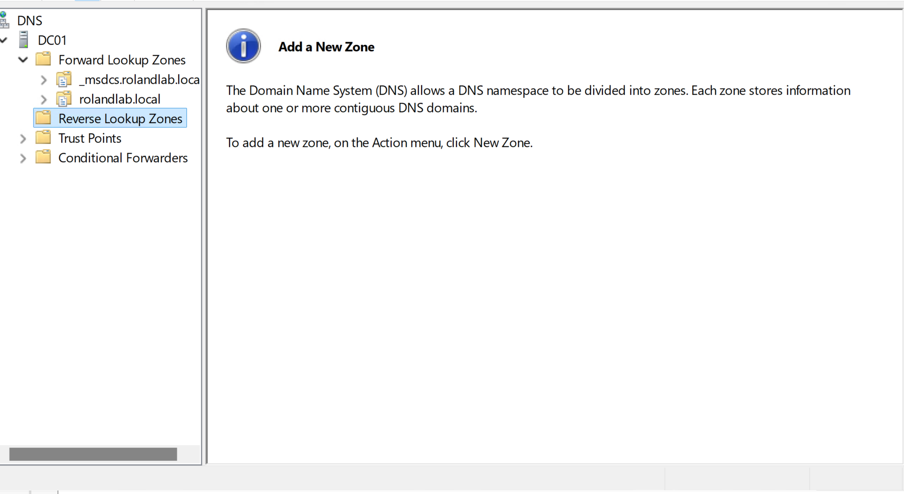

# Domain Name System (DNS)

**Project:** Enterprise MECM Homelab

**Author:** Roland Neequaye

**Version:** 1.0

**Last Updated:** August 2026

---

# Overview

The Domain Name System (DNS) provides name resolution for the entire Enterprise MECM Homelab. Active Directory depends heavily on DNS to locate domain controllers, authenticate users, discover services, and allow communication between servers and clients.

Without a properly configured DNS infrastructure, domain joins, Group Policy processing, Microsoft Configuration Manager (MECM), and many Windows services would fail.

---

# Objectives

The objectives of this deployment were to:

* Install the DNS Server role
* Configure an Active Directory integrated zone
* Verify Forward Lookup Zones
* Verify Reverse Lookup Zones
* Support Dynamic DNS updates
* Validate client name resolution
* Support MECM communication

---

# Server Information

| Item | Value |
|------|-------|
| DNS Server | DC01 |
| Operating System | Windows Server 2025 |
| IP Address | 10.10.10.1 |
| Domain | rolandlab.local |
| Zone Type | Active Directory Integrated |

---

# DNS Architecture

```
CLIENT01
     │
     │ DNS Query
     ▼
DC01
DNS Server
10.10.10.1
     │
     ├── Forward Lookup Zone
     │      rolandlab.local
     │
     └── Reverse Lookup Zone
            10.10.10.x
```

---

# DNS Components

The DNS server hosts the following services.

* Forward Lookup Zone
* Reverse Lookup Zone
* SRV Records
* Host (A) Records
* Pointer (PTR) Records
* Dynamic Updates

---

# Forward Lookup Zone

The following systems were registered inside the Active Directory integrated DNS zone.

| Host | Address |
|------|----------|
| DC01 | 10.10.10.1 |
| MECM01 | 10.10.10.106 |
| CLIENT01 | 10.10.10.102 |

Dynamic updates were enabled allowing domain computers to automatically register DNS records.

---

# Reverse Lookup Zone

A reverse lookup zone was configured to provide IP to hostname resolution.

PTR records were automatically registered for domain joined systems.

---

# Validation

The following validation commands confirmed correct DNS operation.

```powershell
nslookup dc01

nslookup mecm01

nslookup client01

Resolve-DnsName mecm01.rolandlab.local

Get-DnsServerZone
```

All commands completed successfully.

---

# Screenshots

Add screenshots here as the project progresses.







---

# Troubleshooting

## Problem

Incorrect DNS settings prevented successful domain communication.

## Resolution

Verified all domain members pointed only to:

```
10.10.10.1
```

No external DNS servers were configured.

---

## Problem

Client name resolution failed.

## Resolution

Validated A records and PTR records.

Used:

```powershell
ipconfig /registerdns

ipconfig /flushdns

ipconfig /displaydns
```

---

## Problem

MECM depended on DNS to locate the Management Point.

## Resolution

Verified:

```powershell
nslookup mecm01.rolandlab.local

Test-NetConnection MECM01 -Port 80

Test-NetConnection MECM01 -Port 443
```

---

# Skills Demonstrated

* Windows DNS Administration
* Active Directory Integrated DNS
* Forward Lookup Zones
* Reverse Lookup Zones
* Dynamic DNS
* Windows Name Resolution
* DNS Troubleshooting
* PowerShell Administration

---

# Lessons Learned

DNS is one of the most critical components of an Active Directory environment.

During this project it became clear that almost every Windows infrastructure service relies on DNS including:

* Active Directory
* Group Policy
* DHCP
* MECM
* SQL connectivity
* Domain authentication

Proper DNS configuration significantly reduced troubleshooting time throughout the project.

---

# References

* Microsoft Learn
* Windows Server Documentation
* Microsoft Configuration Manager Documentation