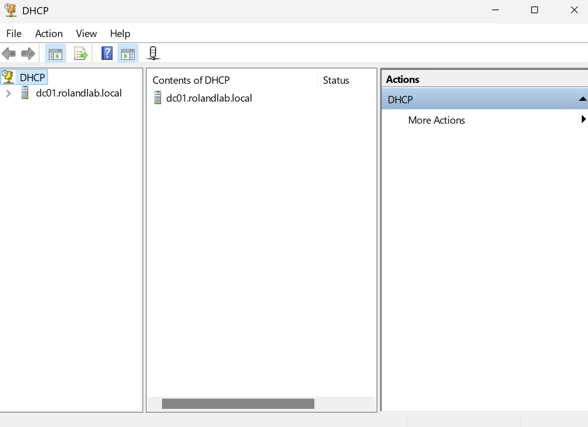
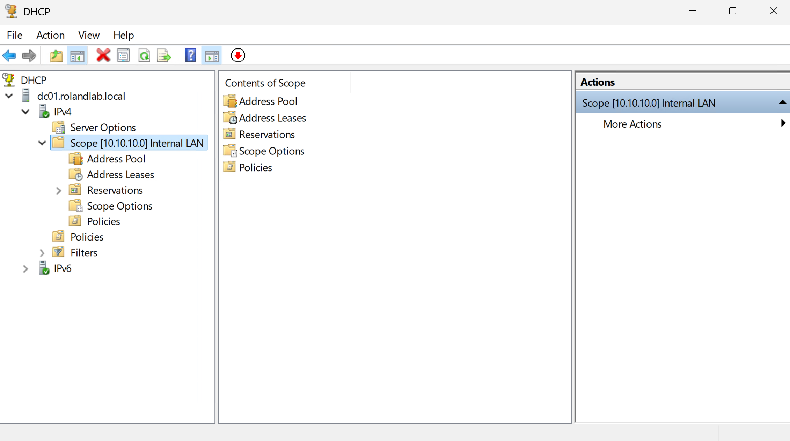
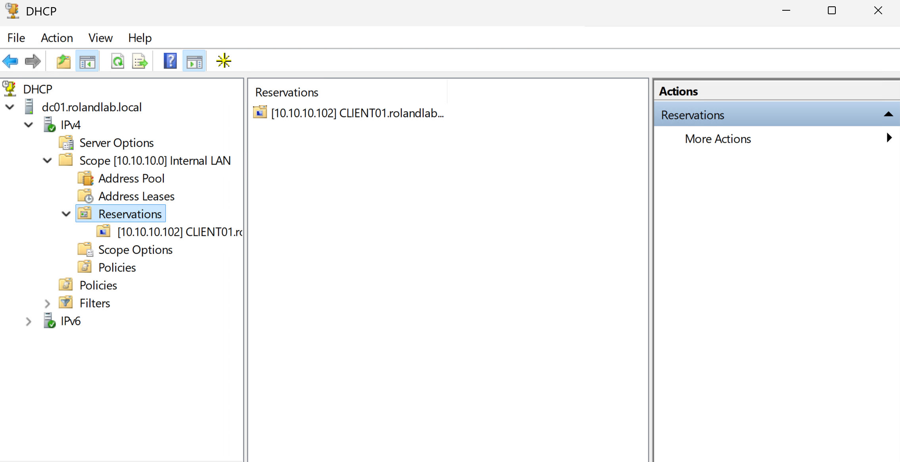
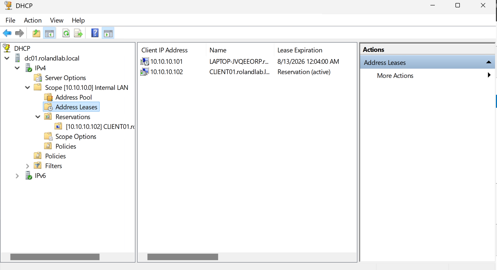

# Dynamic Host Configuration Protocol (DHCP)

**Project:** Enterprise MECM Homelab

**Author:** Roland Neequaye

**Version:** 1.0

**Last Updated:** August 2026

---

# Overview

Dynamic Host Configuration Protocol (DHCP) automatically assigns IP addresses and network configuration to devices within the Enterprise MECM Homelab. Integrating DHCP with Active Directory and DNS simplifies client deployment and ensures consistent network communication across the environment.

---

# Objectives

The objectives of this deployment were to:

* Install the DHCP Server role
* Authorize the DHCP server in Active Directory
* Create an IPv4 scope
* Configure DHCP options
* Enable Dynamic DNS updates
* Configure reservations
* Validate client lease assignment

---

# Environment

| Setting | Value |
|----------|-------|
| Server | DC01 |
| Role | DHCP Server |
| Network | 10.10.10.0/24 |
| Scope Name | Internal Network |
| Gateway | 10.10.10.1 |
| DNS Server | 10.10.10.1 |
| Domain | rolandlab.local |

---

# DHCP Architecture

```
                 CLIENT01
                     │
          Requests IP Address
                     │
                     ▼
                 DHCP Server
                    DC01
                10.10.10.1
                     │
         -------------------------
         |                       |
      DNS Server            Active Directory
```

---

# Scope Configuration

| Setting | Value |
|----------|-------|
| Scope | Internal Network |
| Network | 10.10.10.0/24 |
| Start Address | 10.10.10.100 |
| End Address | 10.10.10.200 |
| Lease Duration | 8 Days |

---

# DHCP Options

| Option | Purpose |
|---------|---------|
| 003 | Default Gateway |
| 006 | DNS Server |
| 015 | DNS Domain Name |

---

# DHCP Reservation

CLIENT01 was configured with a DHCP reservation to ensure a consistent IP address for management and MECM client deployment.

| Device | Reserved Address |
|----------|------------------|
| CLIENT01 | 10.10.10.102 |

---

# Validation

The following commands verified DHCP functionality.

```powershell
ipconfig /all

Get-DhcpServerv4Scope

Get-DhcpServerv4Lease

Get-DhcpServerv4OptionValue
```

The client successfully received:

* IPv4 Address
* DNS Server
* Domain Name
* DHCP Lease

---

# Screenshots

Add screenshots from your lab.









---

# Troubleshooting

## Problem

CLIENT01 did not initially receive the expected IP configuration.

## Resolution

Verified:

* DHCP Scope
* Scope Activation
* DNS Option
* DHCP Authorization

Renewed the lease using:

```powershell
ipconfig /release

ipconfig /renew
```

---

## Problem

Incorrect DNS configuration affected domain communication.

## Resolution

Configured DHCP Option 006 to point to:

```
10.10.10.1
```

---

# Skills Demonstrated

* DHCP Administration
* IP Address Management
* DHCP Reservations
* Active Directory Integration
* DNS Integration
* Windows Server Administration
* Enterprise Troubleshooting

---

# Lessons Learned

Integrating DHCP with Active Directory and DNS provides centralized management and simplifies client deployment.

Proper DHCP configuration significantly reduced manual client configuration and supported successful MECM client deployment throughout the project.

---

# References

* Microsoft Learn
* Windows Server Documentation
* DHCP Best Practices