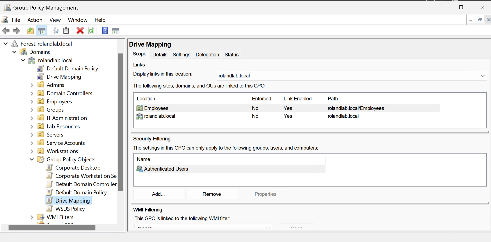
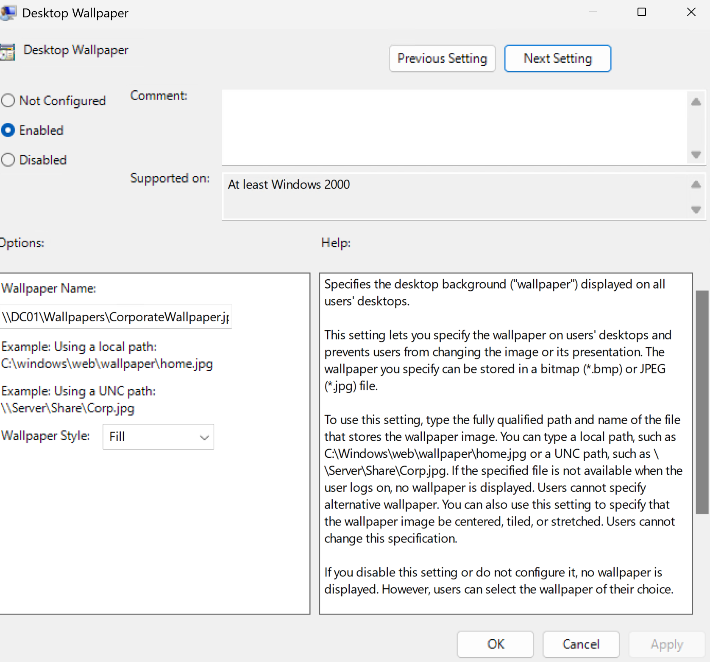
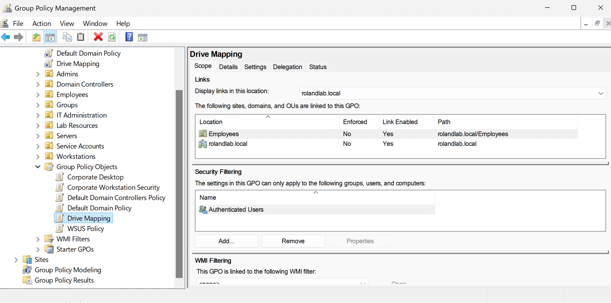
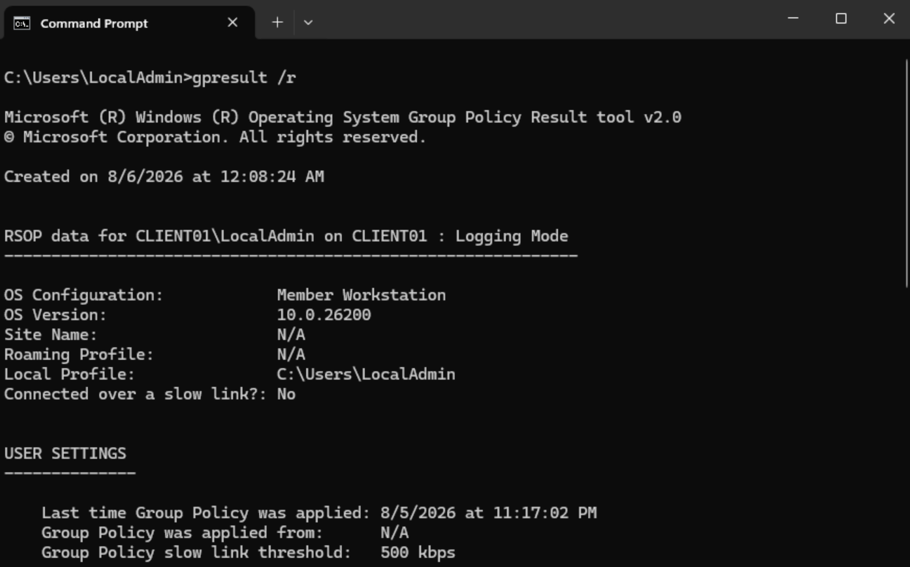

# Group Policy

**Project:** Enterprise MECM Homelab

**Author:** Roland Neequaye

**Version:** 1.0

**Last Updated:** August 2026

---

# Overview

Group Policy provides centralized management of Windows computers and users within the Active Directory environment. It was used throughout this project to enforce security settings, configure desktop policies, and automate resource access.

---

# Objectives

* Configure Group Policy Management
* Create Organizational Unit linked policies
* Configure password policies
* Configure desktop wallpaper
* Configure mapped network drives
* Test Group Policy processing
* Validate policy application

---

# Environment

| Setting | Value |
|----------|-------|
| Domain | rolandlab.local |
| Domain Controller | DC01 |
| Group Policy Console | GPMC |
| Client | CLIENT01 |

---

# Group Policies Implemented

| Policy | Purpose |
|---------|---------|
| Password Policy | Improve account security |
| Wallpaper Policy | Standardized desktop branding |
| Drive Mapping | Automatically map shared folders |
| Registry Restrictions | Prevent unauthorized changes |

---

# Organizational Unit Structure

```text
ROLANDLAB.LOCAL

Employees
│
├── Finance
├── HR
├── IT
├── Sales
└── Operations
```

Policies were linked to the appropriate Organizational Units to demonstrate targeted administration.

---

# Validation

Commands used during testing:

```powershell
gpupdate /force

gpresult /r

gpresult /h C:\Temp\gpresult.html

rsop.msc
```

Validation confirmed:

* Policies applied successfully
* Wallpaper updated
* Network drives mapped
* Password settings enforced

---

# Screenshots

Add screenshots from your lab.









---

# Troubleshooting

## Problem

Group Policy changes did not immediately apply.

## Resolution

Forced a policy refresh.

```powershell
gpupdate /force
```

Verified the applied policies using:

```powershell
gpresult /r
```

---

## Problem

Mapped drive was missing.

## Resolution

Verified:

* Security filtering
* OU membership
* Group Policy link
* Network connectivity

---

# Skills Demonstrated

* Group Policy Administration
* Organizational Unit Design
* Security Policy Configuration
* Drive Mapping
* Windows Administration
* Troubleshooting
* PowerShell

---

# Lessons Learned

Group Policy provides a centralized method of managing Windows environments. Proper OU design and policy targeting greatly simplify administration while reducing manual configuration.

---

# References

* Microsoft Learn
* Group Policy Documentation