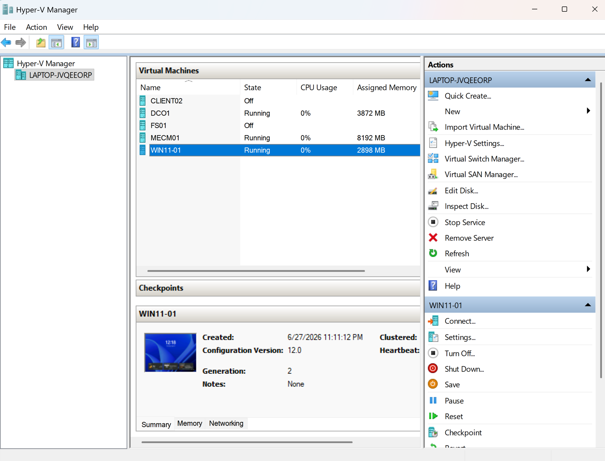
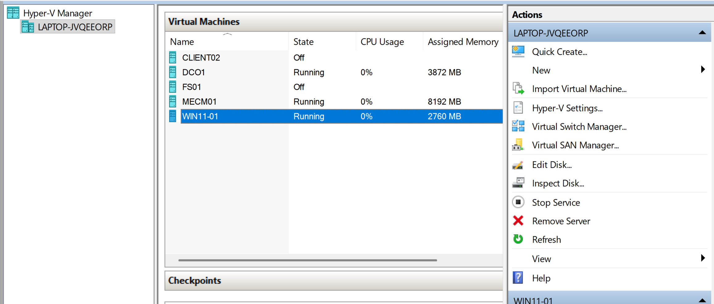
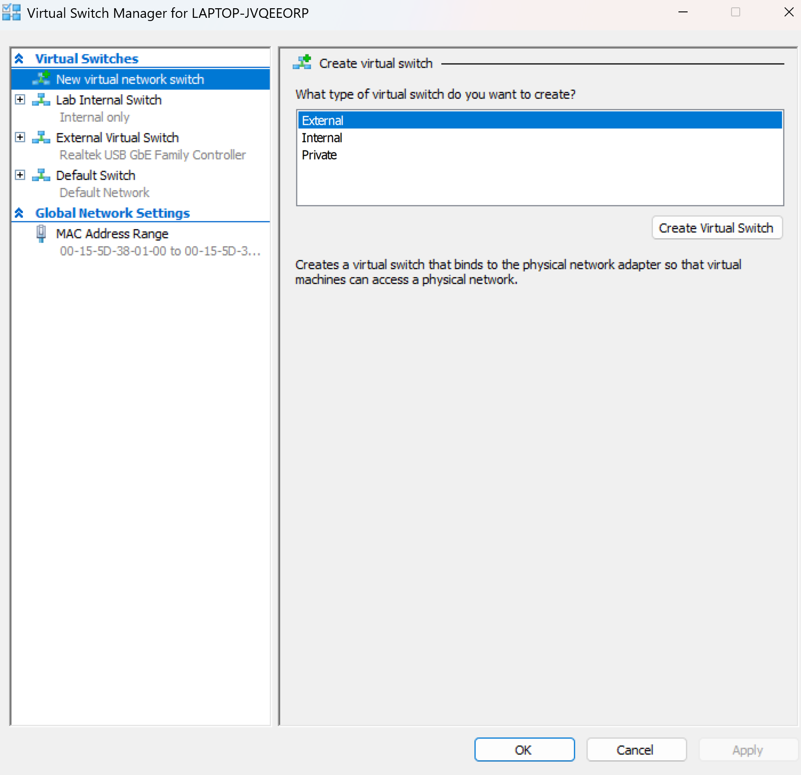
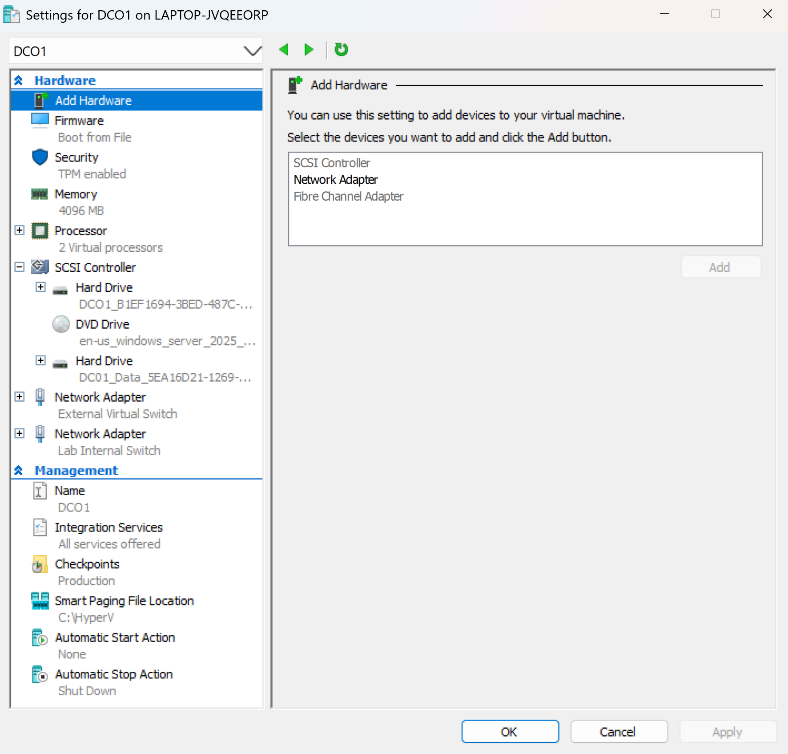
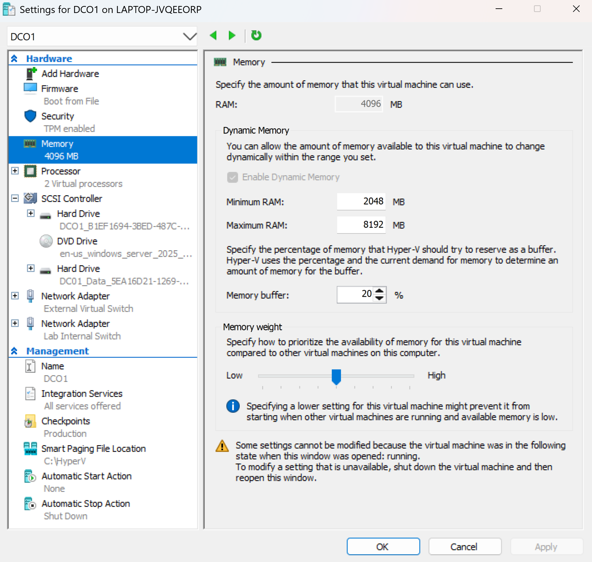
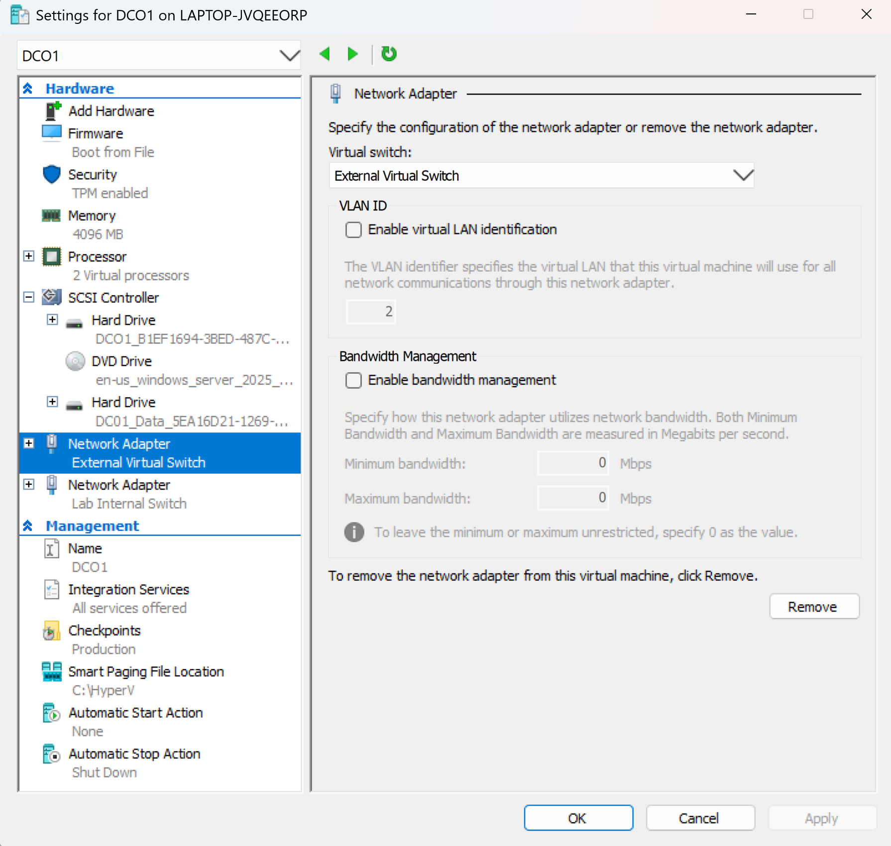

# Hyper-V Virtualization Infrastructure

**Project:** Enterprise MECM Homelab

**Author:** Roland Neequaye

**Version:** 1.0

**Last Updated:** August 2026

---

# Executive Summary

Microsoft Hyper-V was selected as the virtualization platform for this Enterprise MECM Homelab because it is Microsoft's native hypervisor and closely matches enterprise Windows Server environments.

Using Hyper-V allowed the deployment of a complete Windows infrastructure on a single physical computer while maintaining isolated networking, centralized management, and realistic enterprise architecture.

The environment hosts multiple virtual machines that work together to provide Active Directory, DNS, DHCP, RRAS, SQL Server, Microsoft Configuration Manager (MECM), file services, and Windows client management.

---

# Project Objectives

The Hyper-V infrastructure was designed to:

* Build an enterprise Windows domain
* Separate internal and external network traffic
* Support SQL Server and MECM
* Practice enterprise virtualization
* Simulate a production Windows infrastructure
* Learn Microsoft server administration
* Prepare for System Administrator and Cloud Infrastructure roles

---

# Host System Specifications

| Component | Value |
|-----------|-------|
| Computer | Lenovo Laptop |
| Processor | Intel Core i7-7700HQ @ 2.80 GHz |
| Physical Memory | 24 GB DDR4 |
| Host Operating System | Windows 11 Pro |
| Hypervisor | Microsoft Hyper-V |
| Storage | Internal SSD |
| Additional Storage | NAS Backup Repository |

---

# Virtual Machine Inventory

| Virtual Machine | Operating System | Memory | Purpose |
|-----------------|-----------------|--------|---------|
| DC01 | Windows Server 2025 | 4096 MB | Active Directory, DNS, DHCP, RRAS |
| MECM01 | Windows Server 2025 | 8192 MB | SQL Server and Microsoft Configuration Manager |
| FS01 | Windows Server 2022 | 2048 MB | File Server |
| CLIENT01 | Windows 11 Education | 2048 MB | Managed Client |

---

# Infrastructure Architecture

```
                     Internet
                         │
                   Home Router
                  192.168.4.1
                         │
                 External Hyper-V Switch
                         │
             ┌────────────────────────┐
             │         DC01           │
             │  External NIC          │
             │ 192.168.4.10           │
             └────────────────────────┘
                         │
                     RRAS / NAT
                         │
             ─────────────────────────
              Internal Hyper-V Switch
                 10.10.10.0 /24
                         │
     ┌──────────────┬──────────────┬──────────────┐
     │              │              │              │
   DC01          MECM01          FS01         CLIENT01
 10.10.10.1    10.10.10.106     Server      10.10.10.102
```

---

# Virtual Switch Configuration

## External Virtual Switch

Purpose:

* Internet connectivity
* Windows Updates
* Software downloads
* SQL prerequisites
* MECM prerequisite downloads

Connected Devices:

* DC01 External Adapter

---

## Internal Virtual Switch

Purpose:

* Enterprise network simulation
* Active Directory communication
* DNS
* DHCP
* RRAS
* MECM communication
* Client management

Subnet:

```
10.10.10.0/24
```

---

# Storage Configuration

Each virtual machine uses the VHDX disk format.

Benefits include:

* Dynamic expansion
* Better resiliency
* Production checkpoint support
* Larger virtual disk capacity

---

# Backup Strategy

The lab includes a NAS used for backup storage.

Backups include:

* Hyper-V exports
* Configuration files
* Documentation
* PowerShell scripts
* GitHub repository

Future improvements:

* Automated nightly VM exports
* PowerShell backup automation
* Versioned backups

---

# Memory Allocation Strategy

The virtual machines were sized according to workload requirements.

| VM | Memory | Reason |
|----|-------:|--------|
| DC01 | 4096 MB | Directory Services and Infrastructure |
| MECM01 | 8192 MB | SQL Server and MECM require additional memory |
| FS01 | 2048 MB | File Services |
| CLIENT01 | 2048 MB | Windows 11 client testing |

This allocation keeps total memory consumption within the 24 GB available on the host while maintaining acceptable performance.

---

# Hyper-V Features Used

The following Hyper-V features were used throughout the project.

* Virtual Switch Manager
* Dynamic Memory Planning
* Checkpoints
* Virtual Hard Disks (VHDX)
* Virtual Machine Generation 2
* Integration Services
* Export and Import
* Enhanced Session Mode

---

# Validation

The following PowerShell commands were used to validate the Hyper-V environment.

```powershell
Get-VM

Get-VMSwitch

Get-VMNetworkAdapter

Get-VMMemory

Get-VMHardDiskDrive

Get-VMIntegrationService
```

Validation confirmed:

* All virtual machines operational
* Virtual switches functioning correctly
* Network adapters connected
* Memory assigned correctly
* Storage attached
* Integration services running

---

# Screenshots

Add screenshots from your environment.













---

# Troubleshooting

## Challenge

Limited physical memory available for multiple enterprise virtual machines.

### Resolution

* Increased laptop memory from 16 GB to 24 GB.
* Optimized VM memory allocation.
* Powered off unused virtual machines during deployment activities.

---

## Challenge

Internal virtual machines initially had no internet connectivity.

### Resolution

Configured RRAS with Network Address Translation (NAT), allowing the internal Hyper-V network to reach external resources while maintaining network isolation.

---

## Challenge

MECM client deployment failed because internal clients could not download installation files.

### Resolution

Verified:

* Virtual switch configuration
* RRAS
* DNS
* DHCP
* Firewall rules
* SMB connectivity
* Port availability

---

# Skills Demonstrated

* Microsoft Hyper-V Administration
* Enterprise Virtualization
* Virtual Machine Deployment
* Virtual Networking
* Capacity Planning
* Storage Planning
* Backup Strategy
* Windows Server Administration
* Infrastructure Design
* Enterprise Troubleshooting
* PowerShell Administration

---

# Lessons Learned

Designing a virtual enterprise environment requires balancing available hardware resources with workload requirements.

Separating the internal and external networks improved security and accurately simulated a production infrastructure. Careful memory planning and network design were essential to supporting SQL Server, Microsoft Configuration Manager, and Active Directory on a single physical host.

The experience gained from planning, deploying, troubleshooting, and documenting the Hyper-V environment provides a strong foundation for enterprise systems administration and future cloud infrastructure projects.

---

# References

* Microsoft Learn
* Hyper-V Documentation
* Windows Server Documentation
* Microsoft Configuration Manager Documentation