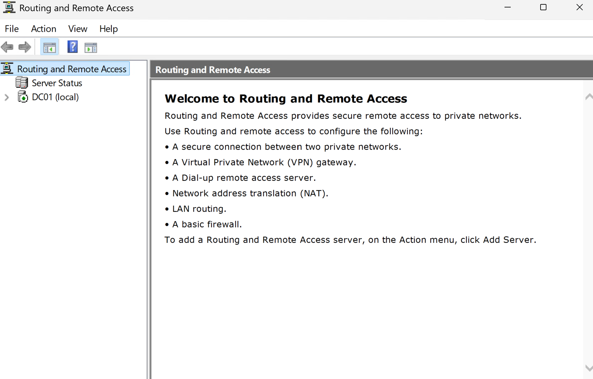
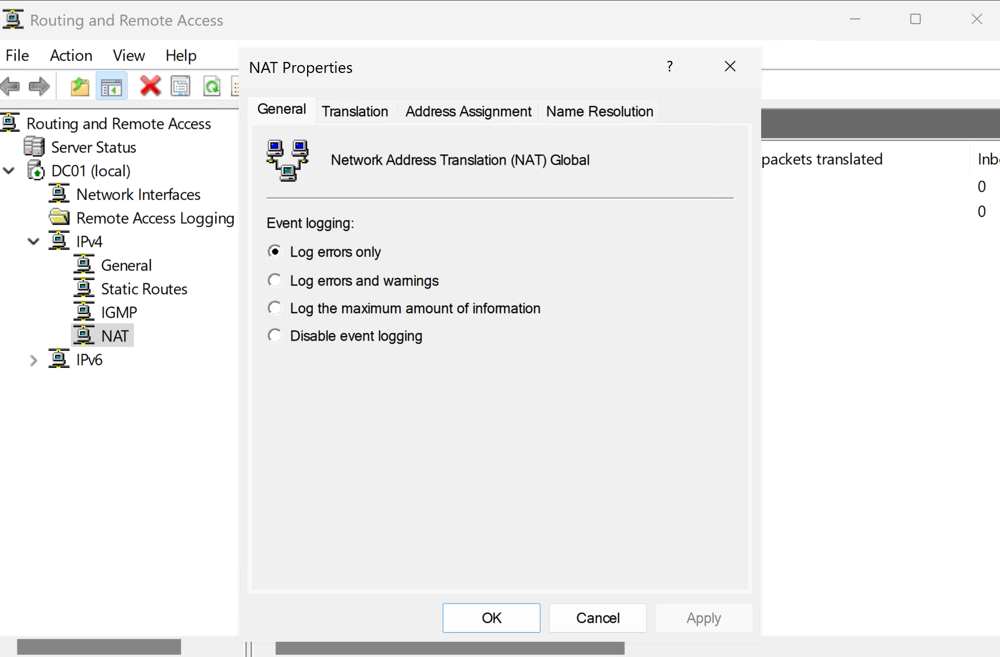
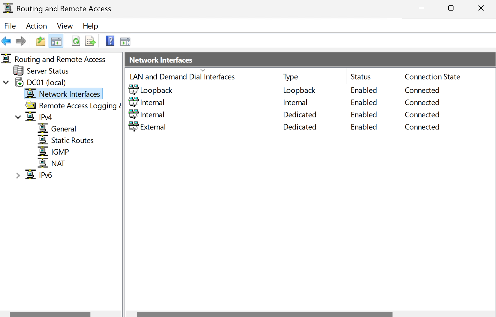
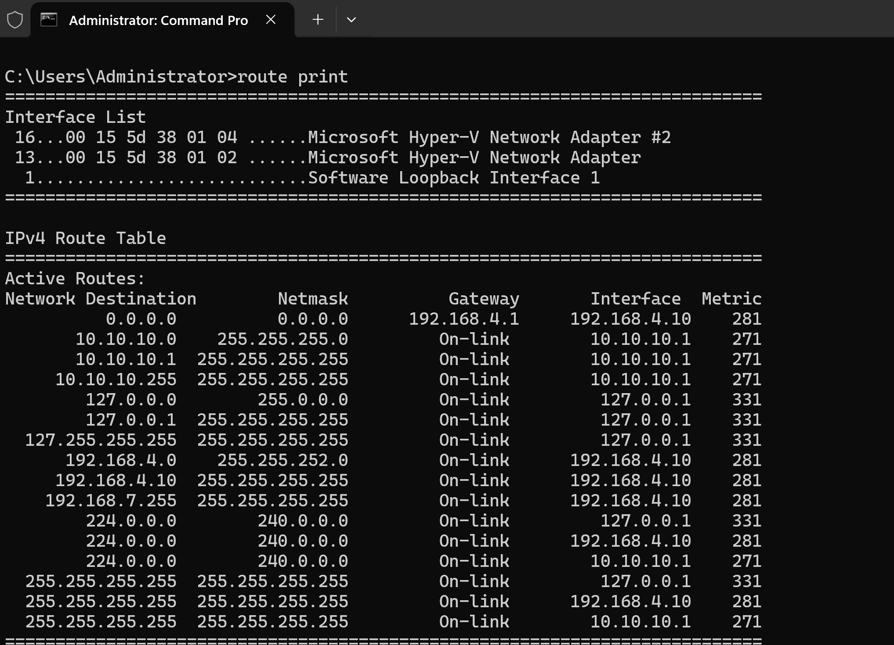

# Routing and Remote Access Service (RRAS)

**Project:** Enterprise MECM Homelab

**Author:** Roland Neequaye

**Version:** 1.0

**Last Updated:** August 2026

---

# Executive Summary

Routing and Remote Access Service (RRAS) was deployed on the domain controller (DC01) to provide Network Address Translation (NAT) between the isolated Hyper-V internal network and the home network.

This configuration enabled virtual machines on the 10.10.10.0/24 network to access external resources while remaining logically separated from the home LAN.

RRAS was a critical component for successful Microsoft Configuration Manager (MECM) client deployment because it allowed Windows clients to download installation files and communicate with the Management Point.

---

# Objectives

The objectives of this deployment were to:

* Install the RRAS role
* Configure NAT
* Provide internet access to the internal network
* Maintain network isolation
* Support Windows Updates
* Support MECM client downloads
* Validate routing functionality

---

# Environment

| Item | Value |
|------|-------|
| Server | DC01 |
| Internal Network | 10.10.10.0/24 |
| Internal Adapter | 10.10.10.1 |
| External Adapter | 192.168.4.10 |
| Gateway | 192.168.4.1 |

---

# Network Architecture

```
                  Internet
                      │
                Home Router
                 192.168.4.1
                      │
          External Hyper-V Switch
                      │
                DC01 External
                192.168.4.10
                      │
               RRAS / NAT Service
                      │
          Internal Hyper-V Switch
                 10.10.10.0/24
                      │
      ┌────────────┬────────────┬────────────┐
      │            │            │            │
   MECM01        FS01        CLIENT01      Future VMs
```

---

# Configuration

RRAS was configured using Network Address Translation (NAT).

The external adapter connected to the home network while the internal adapter served as the gateway for all virtual machines.

This allowed internal systems to reach:

* Microsoft Update
* MECM Distribution Point
* SQL Server
* Domain Services
* External web resources

while remaining isolated from the physical network.

---

# Validation

The following tests confirmed successful configuration.

```powershell
Test-NetConnection MECM01 -Port 80

Test-NetConnection MECM01 -Port 443

ping mecm01

ping dc01

ipconfig /all

route print
```

Validation confirmed:

* NAT functioning correctly
* Internal routing operational
* MECM communication successful
* Client internet connectivity restored

---

# Screenshots

Add screenshots from your lab.









---

# Troubleshooting

## Challenge

CLIENT01 could communicate with domain services but could not download MECM installation files.

### Symptoms

* MECM Client Push failed.
* BITS reported:

```
0x80200010
```

* Client installation repeatedly retried.

### Root Cause

The internal Hyper-V network had no route to external resources.

### Resolution

Configured RRAS with NAT on DC01.

Verified:

* Internal interface
* External interface
* DNS
* DHCP
* Firewall rules

Following the RRAS configuration, MECM client downloads completed successfully.

---

## Challenge

Internal virtual machines could not access internet resources.

### Resolution

Configured:

* NAT
* Gateway
* DHCP Option 003
* DNS Option 006

Validated using:

```powershell
Test-NetConnection

ping

nslookup
```

---

# Skills Demonstrated

* RRAS Administration
* NAT Configuration
* Windows Routing
* Enterprise Networking
* Hyper-V Networking
* Windows Server Administration
* MECM Infrastructure Support
* Troubleshooting

---

# Lessons Learned

Network design has a direct impact on application deployment.

Although Active Directory, DNS, and DHCP were functioning correctly, MECM client deployment depended on proper routing between the isolated Hyper-V network and external resources.

Configuring RRAS demonstrated the importance of understanding Windows networking in addition to server administration.

---

# References

* Microsoft Learn
* RRAS Documentation
* Windows Server Networking Documentation