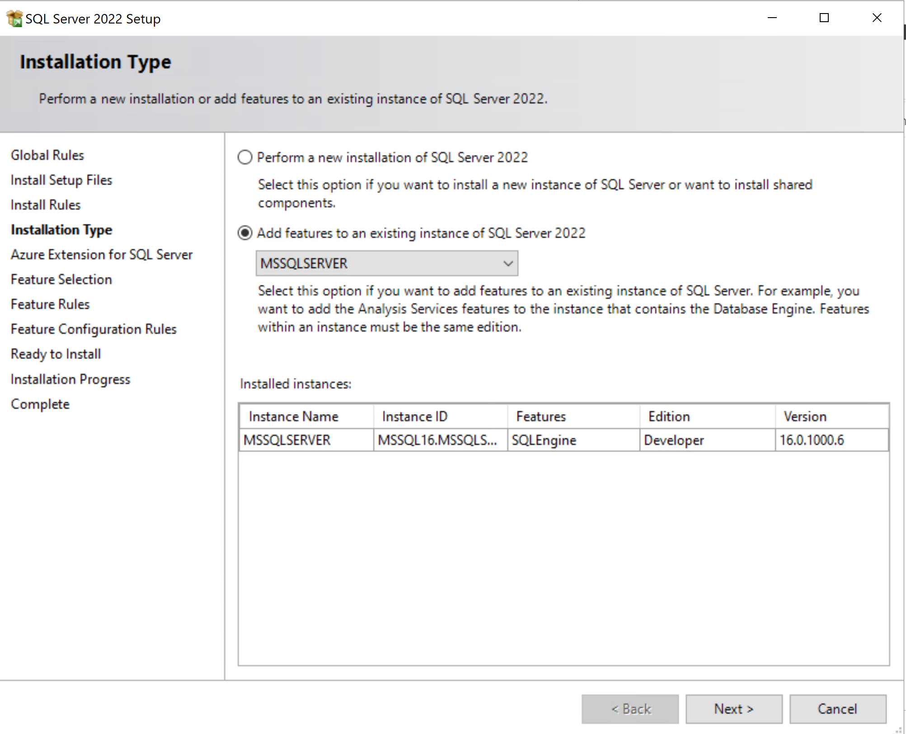
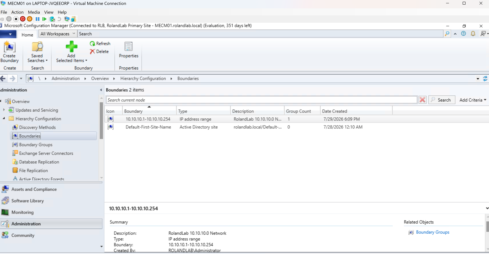
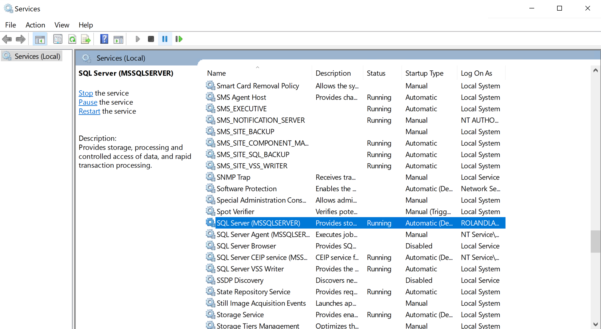

# Microsoft SQL Server

**Project:** Enterprise MECM Homelab

**Author:** Roland Neequaye

**Version:** 1.0

**Last Updated:** August 2026

---

# Executive Summary

Microsoft SQL Server was deployed to support Microsoft Configuration Manager (MECM). SQL Server hosts the MECM site database, providing centralized storage for device inventory, software deployments, client status, reporting, and site configuration.

The deployment followed Microsoft best practices for a small lab environment while maintaining a structure similar to enterprise installations.

---

# Objectives

* Install Microsoft SQL Server
* Configure SQL Server for MECM
* Validate SQL services
* Configure required protocols
* Verify SQL connectivity
* Prepare SQL for MECM site installation

---

# Environment

| Setting | Value |
|----------|-------|
| Server | MECM01 |
| Operating System | Windows Server 2025 |
| SQL Version | SQL Server 2022 |
| SQL Instance | MSSQLSERVER |
| Database Engine | Installed |
| SQL Agent | Installed |

---

# SQL Architecture

```
CLIENT01
      │
      │
      ▼
   MECM Site
      │
      ▼
 SQL Server
      │
      ▼
 MECM Database
```

---

## Installed Components

The following SQL Server components are currently installed.

* Database Engine Services
* SQL Server Configuration Manager
* SQL Server Browser
* SQL Native Client

> **Note:** SQL Server Management Studio (SSMS) is planned for a future phase of the project and will be installed to support database administration, query execution, and MECM database management.

---

# Configuration

SQL Server was configured with:

* Default instance
* Windows Authentication
* Static TCP/IP
* SQL Browser enabled
* Required SQL services running

---

# SQL Services

| Service | Status |
|----------|--------|
| SQL Server | Running |
| SQL Server Agent | Running |
| SQL Browser | Running |

---

# Validation

The following checks confirmed successful installation.

```powershell
Get-Service *SQL*

Get-NetTCPConnection -State Listen |
Where-Object {$_.LocalPort -eq 1433}

Test-NetConnection MECM01 -Port 1433

```

Additional validation included:

* SQL Server Management Studio login
* Database Engine connectivity
* MECM prerequisite validation

---

# Screenshots

Add screenshots from your lab.








---

# Troubleshooting

## Challenge

SQL installation prerequisites required verification before MECM installation.

### Resolution

Verified:

* Windows Firewall
* TCP/IP
* SQL Services
* Windows Authentication
* Available storage

---

## Challenge

MECM prerequisite checker required SQL connectivity.

### Resolution

Confirmed SQL Server was listening correctly and validated connectivity before proceeding with MECM installation.

---

# Skills Demonstrated

* SQL Server Installation
* SQL Configuration
* Windows Server Administration
* Database Services
* SQL Connectivity
* MECM Preparation
* Enterprise Troubleshooting

---

# Lessons Learned

SQL Server is the foundation of Microsoft Configuration Manager.

Careful planning of services, networking, authentication, and storage simplified the MECM installation and reduced troubleshooting during site deployment.

---

# References

* Microsoft Learn
* SQL Server Documentation
* MECM Documentation