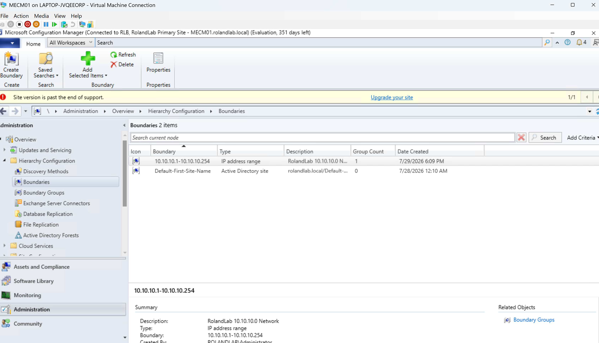
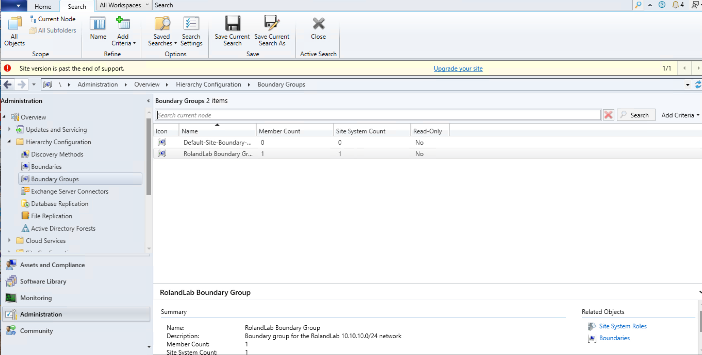
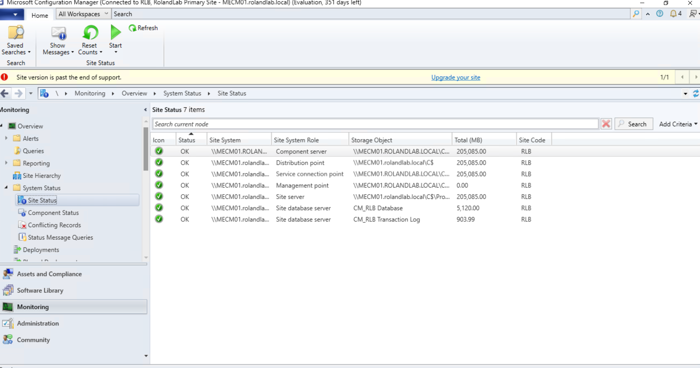
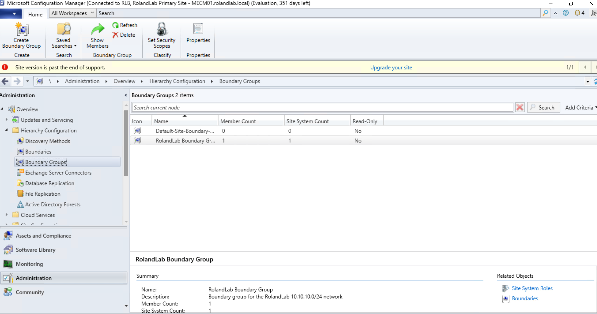
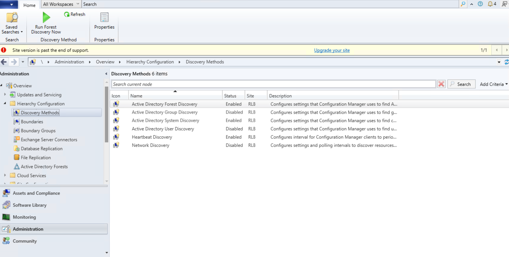
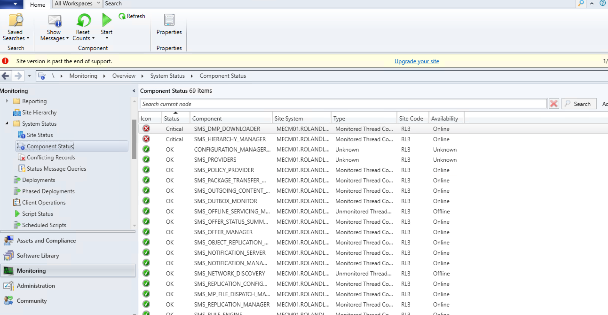

# Microsoft Configuration Manager (MECM) Installation

**Project:** Enterprise MECM Homelab

**Author:** Roland Neequaye

**Version:** 1.0

**Last Updated:** August 2026

---

# Executive Summary

Microsoft Configuration Manager (MECM) was deployed to provide centralized endpoint management within the Enterprise MECM Homelab.

The installation integrated Active Directory, DNS, DHCP, SQL Server, and Windows Server to simulate an enterprise systems management environment.

Following deployment, MECM successfully discovered domain resources and managed Windows client devices.

---

# Project Objectives

* Install MECM Current Branch
* Configure the Primary Site
* Configure SQL connectivity
* Configure Discovery Methods
* Configure Boundaries
* Configure Boundary Groups
* Install Management Point
* Install Distribution Point
* Validate Site Health
* Prepare for Client Deployment

---

# Environment

| Component | Value |
|-----------|-------|
| Server | MECM01 |
| Site Code | RLB |
| Site Name | RolandLab Primary Site |
| SQL Server | MECM01 |
| Domain | rolandlab.local |

---

# Infrastructure Dependencies

MECM relies on the following infrastructure.

| Service | Server |
|----------|--------|
| Active Directory | DC01 |
| DNS | DC01 |
| DHCP | DC01 |
| RRAS | DC01 |
| SQL Server | MECM01 |

---

# Site System Roles

The following site system roles were installed.

* Site Server
* Management Point
* Distribution Point

---

# Discovery Methods

Configured discovery methods include:

* Active Directory Forest Discovery
* Active Directory Group Discovery
* Active Directory System Discovery
* Active Directory User Discovery

---

# Boundaries

Boundary Type

* IP Subnet

Network

```
10.10.10.0/24
```

---

# Boundary Groups

Boundary Group

```
RolandLab Boundary Group
```

Assigned Site

```
RLB
```

---

# Enhanced HTTP

Enhanced HTTP was enabled to simplify client authentication while avoiding the complexity of a PKI deployment.

---

# Validation

The following items confirmed a successful installation.

* Site Installation Complete
* SQL Connectivity Successful
* Management Point Healthy
* Distribution Point Installed
* Discovery Operational
* Boundary Groups Functional

---

# PowerShell Validation

```powershell
Get-Service SMS_EXECUTIVE

Get-Service CcmExec

Test-NetConnection MECM01 -Port 80

Test-NetConnection MECM01 -Port 443
```

---

# Screenshots

Add screenshots from your environment.













---

# Challenges Encountered

Several deployment challenges were encountered during the MECM installation.

Examples include:

* SQL prerequisites
* Client Push Account configuration
* RRAS routing
* Firewall configuration
* DNS communication
* Boundary configuration

Each issue was documented and resolved before proceeding.

---

# Skills Demonstrated

* Microsoft Configuration Manager Administration
* SQL Integration
* Active Directory Integration
* Boundary Configuration
* Discovery Methods
* Management Point Deployment
* Distribution Point Deployment
* Enterprise Troubleshooting

---

# Lessons Learned

Deploying MECM highlighted the importance of planning and validating every supporting infrastructure component before attempting client management.

Each Windows Server role contributed directly to a successful MECM deployment.

---

# References

* Microsoft Learn

* MECM Documentation

* SQL Server Documentation