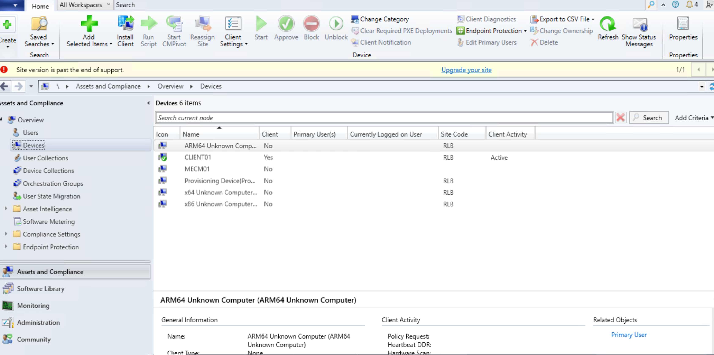
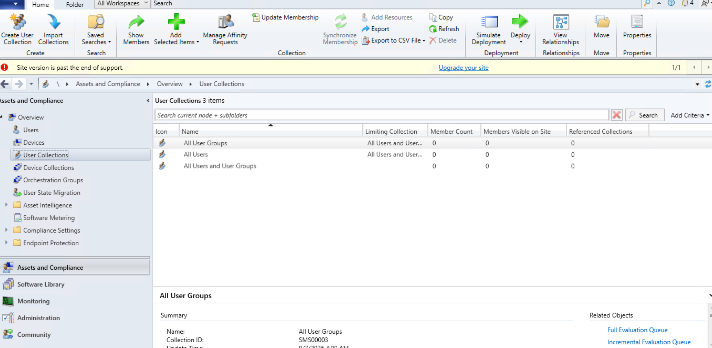
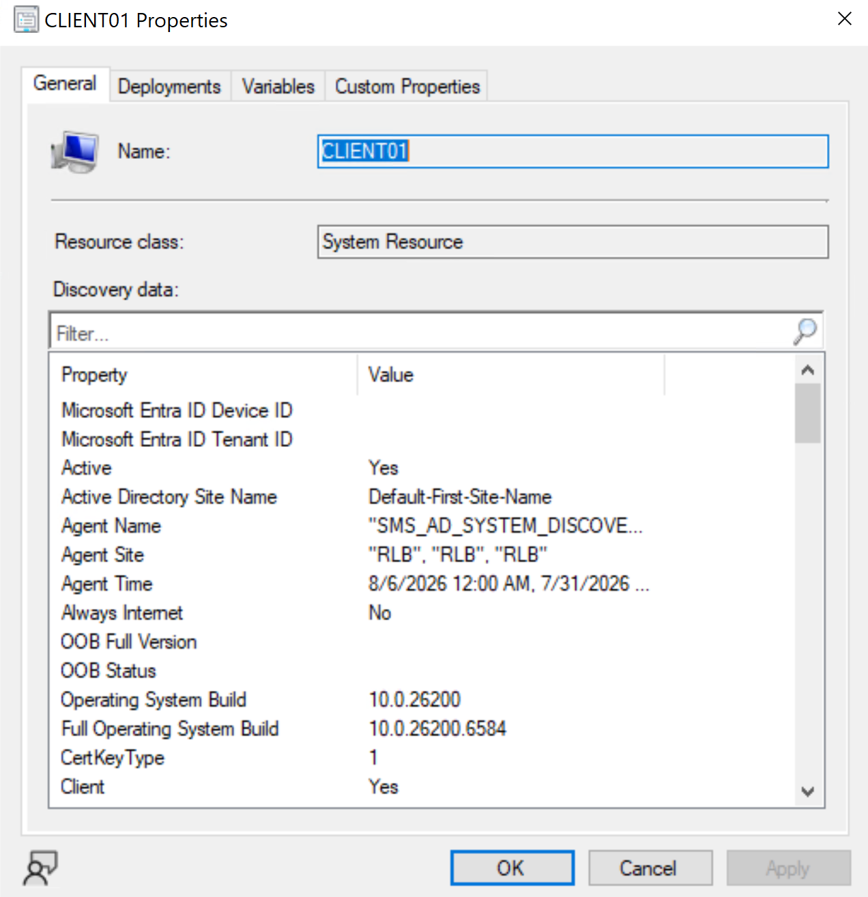
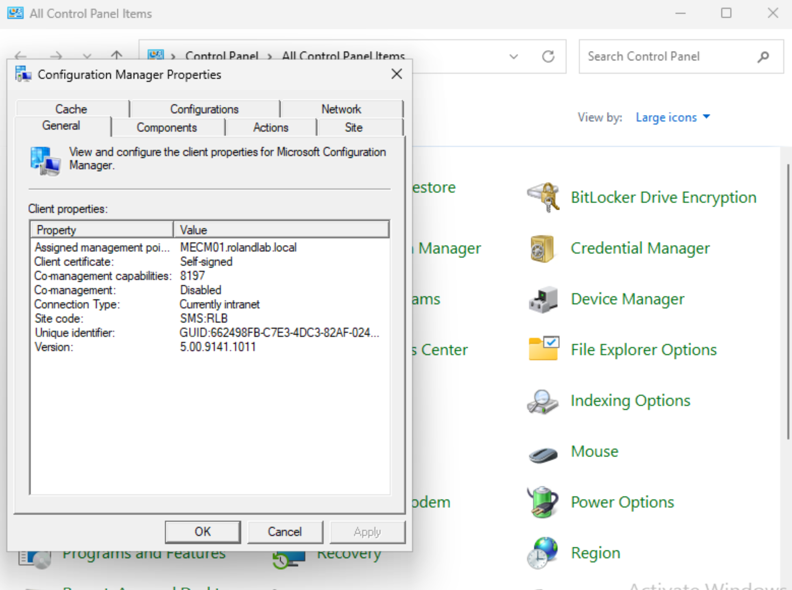

# Microsoft Configuration Manager Client Deployment

**Project:** Enterprise MECM Homelab

**Author:** Roland Neequaye

**Version:** 1.0

**Last Updated:** August 2026

---

# Executive Summary

The MECM client deployment phase successfully onboarded Windows 11 devices into Microsoft Configuration Manager.

The deployment required multiple infrastructure components including Active Directory, DNS, DHCP, RRAS, SQL Server, Management Point, Distribution Point, and Boundary Groups.

Several deployment issues were encountered and resolved before the client installation completed successfully.

---

# Objectives

* Configure Client Push Installation
* Configure Client Push Account
* Deploy MECM Client
* Validate Client Communication
* Verify Management Point Assignment
* Verify Client Registration

---

# Environment

| Component | Value |
|-----------|-------|
| Client | CLIENT01 |
| Operating System | Windows 11 Education |
| Site Code | RLB |
| Management Point | MECM01 |
| Boundary Group | RolandLab Boundary Group |

---

# Client Deployment Workflow

```
CLIENT01

↓

Boundary

↓

Management Point

↓

Distribution Point

↓

Client Download

↓

Installation

↓

Registration

↓

Approved Client
```

---

# Client Push Configuration

Configured:

* Client Push Installation
* Client Push Account
* Automatic Site Assignment
* Management Point Communication

---

# Validation

Commands used

```powershell
Get-Service CcmExec

Test-NetConnection MECM01 -Port 80

Test-NetConnection MECM01 -Port 443

ccmsetup.exe
```

---

# Successful Validation

Verified:

* Client Installed
* CCMExec Running
* Client Assigned
* Client Approved
* Device Visible in Console

---

# Screenshots

Add screenshots.









---

# Challenges Encountered

## Client Push Failed

### Symptoms

Client never installed.

### Root Cause

Firewall and administrative share access.

### Resolution

Verified:

* ADMIN$
* SMB
* File and Printer Sharing
* WMI

---

## Error 53

### Symptoms

Unable to access target machine.

### Resolution

Validated:

* DNS
* RRAS
* Firewall
* Network Path

---

## BITS Error 0x80200010

### Symptoms

Client download failed.

### Resolution

Configured RRAS NAT.

Internet connectivity restored.

---

## Manual Installation

Performed manual client installation using:

```
ccmsetup.exe SMSSITECODE=RLB
```

Installation completed successfully.

---

# Skills Demonstrated

* MECM Administration
* Client Deployment
* Client Push Installation
* Windows Troubleshooting
* Firewall Configuration
* Boundary Configuration
* RRAS
* PowerShell
* Enterprise Networking

---

# Lessons Learned

Client deployment depends on every supporting Windows infrastructure service functioning correctly.

Most deployment failures originated from networking rather than MECM itself.

Understanding Windows networking significantly reduced troubleshooting time.

---

# References

Microsoft Learn

Configuration Manager Documentation